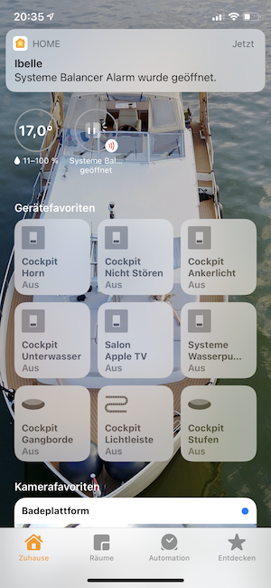

<p align="center">
  <a href="https://github.com/homebridge/homebridge/wiki/Verified-Plugins"></a>
</p>

# Homebridge Signal K
[](https://www.npmjs.com/package/homebridge-signalk)
[](https://www.npmjs.com/package/homebridge-signalk)
[](https://github.com/homebridge/homebridge/wiki/Verified-Plugins)



This is a plugin for the Homebridge server, which maps API keys of a Signal K server to matching [HomeKit](https://www.apple.com/ios/home/) devices.

Use this plugin to read and in case of switches and dimmers even control your boat's devices from your iPhone, iPad, Apple Watch, Apple TV or HomePod. Having an Apple TV 4 or HomePod in your LAN you can read and control even remotely.

## General Prerequisites:
The plugin fills the gap between Homebridge and Signal K, so you need both up and running:
- [Signal K server](https://www.npmjs.com/package/signalk-server)
- [Homebridge server](https://homebridge.io)


## Mapped API keys and devices:
The plugin maps the following [Signal K API keys](http://signalk.org/specification/1.0.0/doc/vesselsBranch.html) to suitable HomeKit devices:

### Environment
The following Signal K standard keys are mapped to temperature and humidity sensors:

/environment/outside/temperature/  
/environment/inside/temperature/  
/environment/inside/engineRoom/temperature/  
/environment/inside/mainCabin/temperature/  
/environment/inside/refrigerator/temperature/  
/environment/inside/freezer/temperature/  
/environment/inside/heating/temperature/  
/environment/water/temperature/  

/propulsion/port/temperature/  
/propulsion/starboard/temperature/  

/environment/outside/humidity/  
/environment/inside/relativeHumidity/  
/environment/inside/engineRoom/relativeHumidity/  
/environment/inside/mainCabin/relativeHumidity/  
/environment/inside/refrigerator/relativeHumidity/  
/environment/inside/freezer/relativeHumidity/  
/environment/inside/heating/relativeHumidity/  

### Tanks
The following Signal K standard keys for tanks are mapped to humidity sensors:

/tanks/*  

HomeKit does not support tank sensors yet, so a humidity sensor is the best matching device showing percentages. Tanks on low level (freshwater, fuel, lubrication, live well, gas, ballast) or high level (wastewater, blackwater) show a low battery warning.


### Batteries and chargers
The following Signal K standard keys for batteries and chargers are mapped to humidity sensors and switches:

/electrical/batteries/\*  

/electrical.chargers/<#>/mode (planned for future version)   
/electrical.chargers/<#>/capacity.stateOfCharge (planned for future version)

HomeKit does not support batteries as stand alone devices yet, so a humidity sensor is the best matching device showing percentages representing the state of charge. Batteries on low level show a low battery warning.


### EmpirBus NXT switches and dimmers
Keys generated by the [Signal K EmpirBus NXT plugin](https://www.npmjs.com/package/signalk-empirbusnxt-plugin) are mapped to switches and dimmers:

/electrical/switches/empirBusNxt-instance\<id\>-dimmer\<id\>/  
/electrical/switches/empirBusNxt-instance\<id\>-switch\<id\>/  

EmpirBus NXT switches connected to sensors can be mapped to HomeKit leak sensors by marking as device type leak sensor (see section optional parameters `deviceTypes`).

#### Prerequisite:
[Signal K EmpirBus NXT plugin](https://www.npmjs.com/package/signalk-empirbusnxt-plugin)


### Venus GX switches and dimmers
Keys generated by the [Signal K Venus plugin](https://www.npmjs.com/package/signalk-venus-plugin) are mapped to switches and dimmers:

/electrical/switches/venus-0/  
/electrical/switches/venus-1/  

#### Prerequisite:
[Signal K Venus plugin](https://www.npmjs.com/package/signalk-venus-plugin)


### Generic switches
Keys generated by standard N2K PGNs or the [Signal K N2K Switching-Translator plugin](https://www.npmjs.com/package/signalk-n2k-switching-translator) are mapped to switches:

 /electrical/switches/\*  

 Use with the [Signal K N2K Switching plugin](https://www.npmjs.com/package/signalk-n2k-switching). Known supported devices: Yacht Devices Circuit Control YDCC-04, Yacht Devices Switch Control and Maretron DCR100

 #### Prerequisite:
[Signal K N2K Switching plugin](https://www.npmjs.com/package/signalk-n2k-switching)


### Raspberry Pi
Keys generated by the [Signal K Raspberry Pi Temperature plugin](https://www.npmjs.com/package/signalk-raspberry-pi-temperature) are mapped to temperature sensors:

/cpu/temperature/

#### Prerequisite:
[Signal K Raspberry Pi Temperature plugin](https://www.npmjs.com/package/signalk-raspberry-pi-temperature)


### Contact sensors
Configure contact sensors for any Signal K API key, which are triggered when their values reach a threshold, e.g.:

/navigation/speedOverGround > 0.1 → Vessel under way, switch on navigation lights  
/electrical/batteries/0/current > 0 → Shore power connected, batteries charging  
/electrical/batteries/0/capacity/timeRemaining < 7200 → Battery warning, switch off heavy    loads  

## Configuration
The plugin awaits and accepts the following settings in the Homebridge `config.json` file:

### Required parameters:
`"platform" : "SignalK"`  
`"host": "127.0.0.1:3000"` IP address and port of Signal K server  

### Optional parameters and their default values if omitted:
`"name" : "NameOfVessel"`  
`"ssl": false` Set to `true` if Signal K server is awaiting connections via SSL  
`”accessRequest”: true` Set to `true` if Homebridge shall use Access Requests to request and be granted access to the Signal K server  

`”securityToken”: “explicit.signalk.token.here”` Signal K server security token (token entered here overrides token from access requests)  
`"signalKInitializeDelay": "10000"` Delay before adding or removing devices to give Signal K time to build API tree (in milliseconds)  
`"autodetectNewAccessoriesInterval": "900000"` Interval to check for new devices (in milliseconds)  
`”accessRequestInterval”: “60000”` Interval to check Signal K access request status (in milliseconds)  

`"emptyBatteryVoltage" : "22.0"` Battery SOC shown as 0% (ignored if SOC is reported from battery)  
`"lowBatteryVoltage" : "23.5"` Low battery warning if battery voltage is at or below  
`"fullBatteryVoltage" : "26.0"` Battery SOC shown as 100% (ignored if SOC is reported from battery itself)  
`"chargingBatteryVoltage" : "27.0"`Battery shown as charging if battery voltage is at or above (ignored if current is reported from battery)  
`"lowFreshWaterLevel" : "25.0"` Low tank (battery) warning if tank level is at or below  
`"highWasteWaterLevel" : "75.0"` Low battery warning if tank level is at or above  
`"highBlackWaterLevel" : "75.0"` Low battery warning if tank level is at or above  
`"lowFuelLevel" : "50.0"` Low tank (battery) warning if tank level is at or below  
`"lowLubricationLevel" : "50.0"` Low tank (battery) warning if tank level is at or below  
`"lowLiveWellLevel" : "50.0"` Low tank (battery) warning if tank level is at or below  
`"lowGasLevel" : "50.0"` Low tank (battery) warning if tank level is at or below  
`"lowBallastLevel" : "50.0"` Low tank (battery) warning if tank level is at or below  

`"removeDevicesNotPresent": false` If set to `true` devices which are not present in API keys (after restart of Signal K server) are removed from HomeKit (at start of Homebridge server). Set to `false` to prevent devices disappearing after rebooting Raspberry Pi in case homebridge loads faster than the Signal K tree is filled.  

`"ignoredPaths": ["key","key"]` List of API keys for which you don't want to have a device in HomeKit. Devices will be deleted from HomeKit if already present.  

`"displayNames": {"key":"Display Name","key":"Display Name"}` List of API keys and respective display names to display for them in HomeKit. Saves the effort to rename devices in HomeKit manually. Spaces and Umlauts are allowed.  

`"deviceTypes": {"key":"device type","key":"device type"}` List of API keys and respective device types to be mapped to in HomeKit. Currently only EmpirBus NXT keys are processed and device type can be `leakSensor` only.

### Contact sensors
Create contact sensors by a list of objects with Signal K API key, name for contact sensor in HomeKit, operator and treshold:
```
"contactSensors": [
  { "key": "<API key, must be unique>",
    "name": "<Name in Homekit>",
    "operator": "<Operator =, !=, >, >=, <= or < (default)>",
    "treshold": "<treshold of operator (default is 0)>"
  },
  { "key": "electrical.batteries.0.current",
    "name": "Shore Power",
    "operator": ">",
    "treshold": "0"
  }
]
```

## Debugging
To monitor communication with Signal K start HomeBridge with DEBUG environment variable:    
`DEBUG=homebridge-signalk:http` Signal K API requests  
`DEBUG=homebridge-signalk:websocket` Signal K WebSocket updates  

## Support
Use #homebridge channel on the [Signal K Slack](http://slack-invite.signalk.org/).
